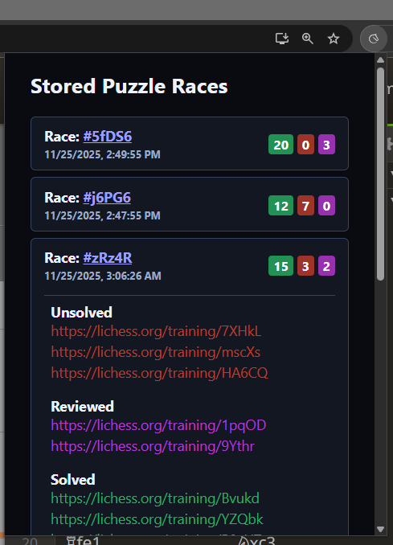
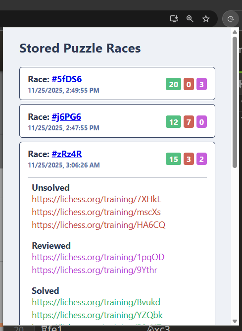

# Lichess Puzzle Racer Collector

A Chrome extension that automates collecting unsolved puzzles from Lichess puzzle racer.

## Overview

The **Lichess Puzzle Racer Collector** extension helps you efficiently track and manage puzzle races and training sessions from Lichess. It automatically collects unsolved puzzle links and provides an organized interface to manage and revisit them.

This extension was inspired to help [ElyneLee](https://www.twitch.tv/elynelee) keep track of unsolved puzzles from previous puzzle racer runs, allowing for easy review and solving of those puzzles after the races.

## Features

- 🎯 **Automatic Puzzle Collection** - Collects unsolved puzzles from Lichess puzzle modes
- 📋 **Organized Storage** - Maintains a structured list of collected puzzle races
- 🔗 **Quick Navigation** - Easy access to stored puzzle links
- 📊 **Puzzle Tracking** - Keeps track of puzzle race sessions with timestamps
- 🎮 **Multi-Mode Support** - Works with both Puzzle Racer and Puzzle Training modes
- 🌓 **Light & Dark Theme Support** - Automatically adapts to your system theme preference

## Supported Modes

- **Puzzle Racer** (`lichess.org/racer/*`)
- **Puzzle Training** (`lichess.org/training/*`)

## Installation

1. Clone or download this repository
2. Open Chrome and navigate to `chrome://extensions/`
3. Enable "Developer mode" (toggle in the top right)
4. Click "Load unpacked" and select this extension directory
5. The extension icon will appear in your Chrome toolbar

## Usage

1. **Navigate to Lichess Puzzles**
   - Visit `lichess.org/racer` or `lichess.org/training` in Chrome

2. **Collect Puzzles**
   - Solve puzzles as normal
   - The extension automatically collects unsolved puzzle links

3. **View Stored Puzzles**
   - Click the extension icon in the toolbar
   - A popup displays all collected puzzle races organized by timestamp

4. **Access Puzzles**
   - Click any puzzle link in the popup to navigate to it
   - Links are opened in the active tab for seamless navigation

## File Structure

```
lichess-puzzles-extension/
├── manifest.json              # Extension manifest (v3)
├── popup.html                 # Popup UI
├── README.md                  # This file
├── icons/
│   ├── 16.png                # Toolbar icon (16x16)
│   ├── 48.png                # Toolbar icon (48x48)
│   └── 128.png               # Toolbar icon (128x128)
├── scripts/
│   ├── background.js          # Background service worker
│   ├── content_racer.js       # Content script for Racer mode
│   ├── content_training.js    # Content script for Training mode
│   ├── popup.js              # Popup UI controller
│   └── test-data.js          # Test data for development
└── styles/
    ├── resets.css            # CSS reset styles
    └── styles.css            # Main stylesheet
```

## How It Works

1. **Content Scripts** - Monitor puzzle activity on Lichess pages
2. **Background Worker** - Manages storage and data persistence
3. **Popup Interface** - Displays collected puzzles and provides navigation
4. **Chrome Storage API** - Persists puzzle data across sessions

## Permissions

- `tabs` - Required to get the current active tab URL
- `activeTab` - Allows interaction with the active tab
- `storage` - Persists puzzle data
- `host_permissions` - Accesses `https://lichess.org/*`

## Browser Support

- Chrome/Chromium-based browsers with Manifest V3 support

## Development

This extension uses Chrome Manifest V3 and Chrome Storage API. The popup displays puzzle data organized by:
- **Solved Races** - Completed puzzle sessions
- **Open Races** - In-progress puzzle sessions
- Sorting by timestamp (latest first)

## License

This project is provided as-is for personal use.

## Contributing

Feel free to submit issues or suggestions for improvements!

## Popup UI

The extension provides a clean, organized interface for managing collected puzzles:

- **Dark Theme** - Default theme with a sleek dark interface
- **Light Theme** - Bright, eye-friendly light theme

The popup displays:
- All collected puzzle races sorted by timestamp (latest first)
- Puzzle status badges (unsolved, reviewed, solved)
- Quick links to navigate to specific puzzles
- Current tab indicator to show which puzzle you're viewing

## Theme Screenshots

<div style="display: flex; gap: 20px; justify-content: center;">
  <div style="text-align: center; flex: 1;">
    <h3>Dark Theme</h3>
    
  </div>
  <div style="text-align: center; flex: 1;">
    <h3>Light Theme</h3>
    
  </div>
</div>
